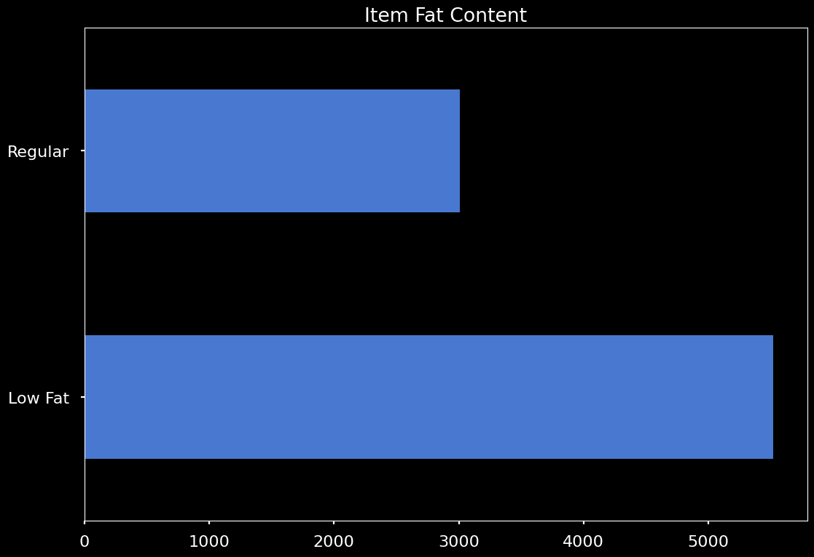

# Product Sales Prediction

Hello and welcome to my analysis of the product sales from sales_predictions.csv.

The purpose here is to analyze the factors which contribute to increases or decreases in product sales. Based on this information, I will recommend a predictive model in order to potentially make future observations regarding product sales. To start, I would like to go through a few observations concerning this data set.

# Data

Below is a table of correlations in the data set shown by a heatmap. It is worth noting that this is only a correlation of numerical data types. There is no catagorical data shown.

Based on this heatmap of correlations, there is clearly a moderate correlation between maximum retain price (Item_MRP) and sales (Item_Outlet_Sales), which makes perfect sense.

Another area i took into consideration was the distribution of low fat items and regular items along with how these two factors relate to product sales. The chart below simply shows that low fat items represent the majority of items. 

# Predictive Models 

So far, several models have been attempted with certain models showing quite a lot of potential. In my first notebook titled "prediction_of_product_sales_j_hunter.ipynb" the two best models were the gradient boosting regressor and the neural network. The gradient boosting regressor has comparatively low root mean squared error and a reasonably high R^2 score of 60%. This model with some refinement is looking rather promising. 

In my notebook titled "Project 1 - Revisited.ipynb", I went about searching for the best features worth focussing in on. Out of both models attempted in this particular notebook, I chose the random forest model due to its high training accuracy compared to the other model that I tried, which was a linear regressor. The random forest model allowed me to discover the coefficients worth focussing in on, as can be seen in the figure below.

Here we see the five most important features. 
* Item Price
* Grocery store
* Visibility
* Weight
* Type 3 Supermarket

# SHAP Explanations

In order to better construct an idea of exactly how the top features are affecting the target, I used the SHAP library in order to create a couple of helpful visualizations. Below can be seen a graph of the top features according to this SHAP framework.

We can see that there are similarities with the graph above this one. Both ways of identifying key features agree that item MSRP and the outlet type being a grocery store are vitally important when it comes to predicting product sales. Other importances do vary but are still relevant according to both methods of observing the feature data.

Below we can get a sense of exactly how each feature alter's the model's predictions. Item MSRP has a profound impact on product sales, which is a fairly obvious observation. Though, the more specific interpretation is that a lower price will generally lead to a higher number of sales. We can also see that if the outlet is a grocery store, there will be a significant decrease in product sales. If the outlet is a type 3 supermarket; however, there will be a marked increase in product sales. The relationship between outlet type and product sales can also be seen in the next figure below the SHAP feature data.

