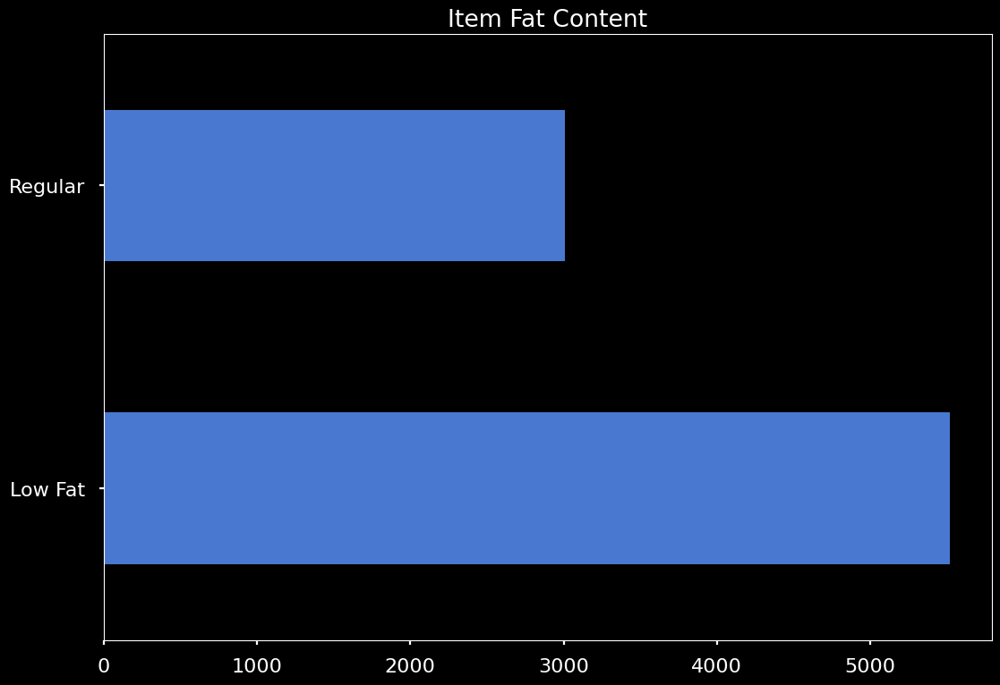
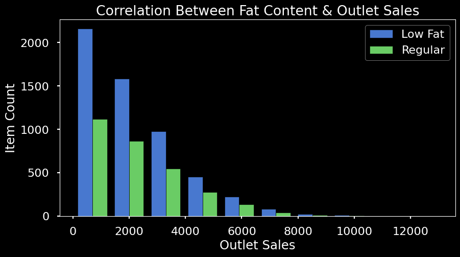

# Product-Sales-Prediction

Hello and welcome to my analysis of the product sales from sales_predictions.csv.

The purpose here is to analyze the factors which contribute to increases or decreases in product sales. Based on this information, I will recommend a predictive model in order to potentially make future observations regarding product sales. To start, I would like to go through a few observations concerning this data set.

# Data

Below is a table of correlations in the data set shown by a heatmap. It is worth noting that this is only a correlation of numerical data types. There is no catagorical data shown.

Based on this heatmap of correlations, there is clearly a moderate correlation between maximum retain price (Item_MRP) and sales (Item_Outlet_Sales), which makes perfect sense.

Another area i took into consideration was the distribution of low fat items and regular items along with how these two factors relate to product sales. The chart below simply shows that low fat items represent the majority of items. 

The histogram below demonstrates the relationship between low fat items, regular items, and outlet sales.

despite low fat items reprenting the majority of items, regular items seem to correlate with increased outlet sales based on the above chart.

# Predictive Model 

Regarding predictive modelling, for the time being I have come to the conclusion that a linear regression would be best. IT should be noted that this model has fairly high bias, meaning that it seems to underfit the actual given data somewhat. The testing data was accurate within about 56% of the actual data, which is not optimal. I believe future research may be required in order to find a model even better than the linear regression.
