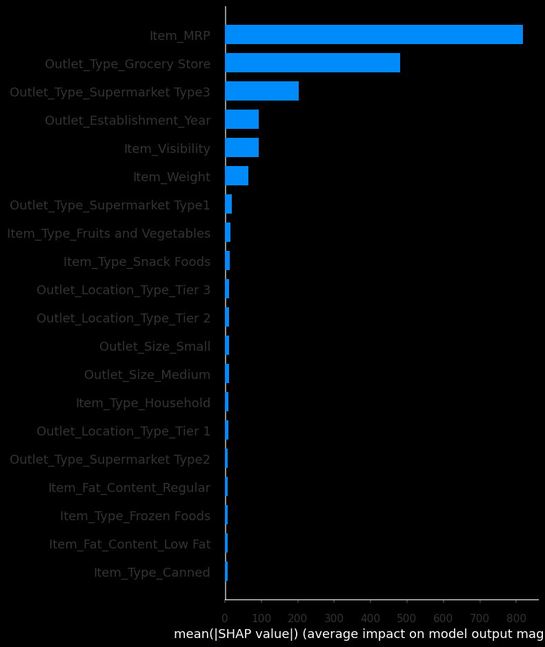

# Product Sales Prediction

Hello and welcome to my analysis and prediction of product sales!

The data used for this analysis originated from Kaggle and can be found here at sales_prediction.csv in this repository. 

What am I going to do with this data?

Here are the steps I will use in order to analyze this sales data and make meaningful predictions.
* Initial Analysis & Findings
* Machine Learning Models
* Deep Analysis & Findings
* Data Driven Recommendations

# Initial Analysis & Findings

What was I able to find with a cursory glance at the data, so to speak?

Below are just a few of the correlations that I could find in the data relating to product sales. 

Based on this heatmap of correlations, there are two features which have a positive relationship with sales. 
* Item Maximum Retail Price
* Item Visibility

It is worth keeping in mind that the above correlation graph only accounts for numerical data. We can look at other data types as well. One area in which I noticed a major trend was in super market type. The graph is displayed below. 

What does the above graph mean? We can see that grocery stores seem to have both the lowest outlet sales and lowest item maximum retail prices. Meanwhile, type 3 supermarkets have both the highest sales and the highest maximum ratail prices. We will see this trend continue further in this data analysis. 

# Machine Learning Models 

So far, several models have been attempted with certain models showing quite a lot of potential. In my first notebook titled "prediction_of_product_sales_j_hunter.ipynb" the two best models were the gradient boosting regressor and the neural network. The gradient boosting regressor has comparatively low root mean squared error and a reasonably high R^2 score of 60%. This model with some refinement is looking rather promising. 

The coefficients of my linear regression model are shown below.

The most important coefficients are as follows. How these were gathered can be found within "Project 1 - Revisited.ipynb" within this repository. These are based on the absolute values of the coefficients.
* Type 3 Supermarket
* Grocery Store Outlet Type
* High Outlet Size
* Type 2 Supermarket
* Medium Outlet Size

In my notebook titled "Project 1 - Revisited.ipynb", I went about searching for the best features worth focussing in on. Out of both models attempted in this particular notebook, I chose the random forest model due to its high training R^2 score compared to the other model that I tried, which was a linear regressor. The random forest model allowed me to discover the coefficients worth focussing in on, as can be seen in the figure below.

Here we see the five most important features. 
* Item Price
* Grocery store
* Visibility
* Weight
* Type 3 Supermarket

These feature will continue to be vitally important throughout. We can see that the outlet being a grocery store or a type 3 supermarket are important factors, as was discussed in the previous section.The item's maximum retain price is the highest feature in terms of importance. We will discuss more regarding why that is in the next section and in my recommendations. 

# Deeper Analysis & Findings 

In order to better construct an idea of exactly how the top features are affecting the target, I used the SHAP library in order to create a couple of helpful visualizations. Below can be seen a graph of the top features according to this SHAP framework. It is worth keeping in mind that the plots below represent a sample size of 400 rows taken from the total of over 6000 rows within the data set.

We can see that there are similarities with the graph in the previous section. Both ways of identifying key features agree that item MRP and the outlet type being a grocery store are vitally important when it comes to predicting product sales. Other importances do vary but are still relevant according to both methods of observing the feature data.

Below we can get a sense of exactly how each feature alter's the model's predictions. Item MRP has a profound impact on product sales, which is a fairly obvious observation. Though, the more specific interpretation is that a lower price will generally lead to a higher number of sales. We can also see that if the outlet is a grocery store, there will be a significant decrease in product sales. If the outlet is a type 3 supermarket; however, there will be a marked increase in product sales. The relationship between outlet type and product sales can also be seen in the next figure below the SHAP feature data.

The figure directly above shows specifically just how important outlet type is to product sales. Now we will pivot to more specific areas of the data. What are the rows of data with the lowest sales and the highest sales? Which factors contribute the most to these products selling so well or so poorly?

# Row With Maximum Sales

We can see that the row with maximum outlet sales is affected by the outlet not being a grocery store primarily. It also has a high maximum retail price and a high visibility. This means that the item is large and expensive. We can also see that the item is from a type 3 supermarket, which makes sense based on what has been shown in the previous sections.

# Row With Minimum Sales

What we have above is the row with minimal product sales. This row comes from a grocery store and is affected specifically by not being from a type 3 supermarket. The item maximum retail price is also quite low.

# Recommendations

Based on the data and findings above, here is my overall list of recommendations.
* Higher maximum retail price correlates with increased sales.
* The outlet being a grocery store correlated with decreased sales.
* The outlet being a type 3 supermarket correlates with increased sales.
* Larger items with higher visibility have increased outlet sales.
